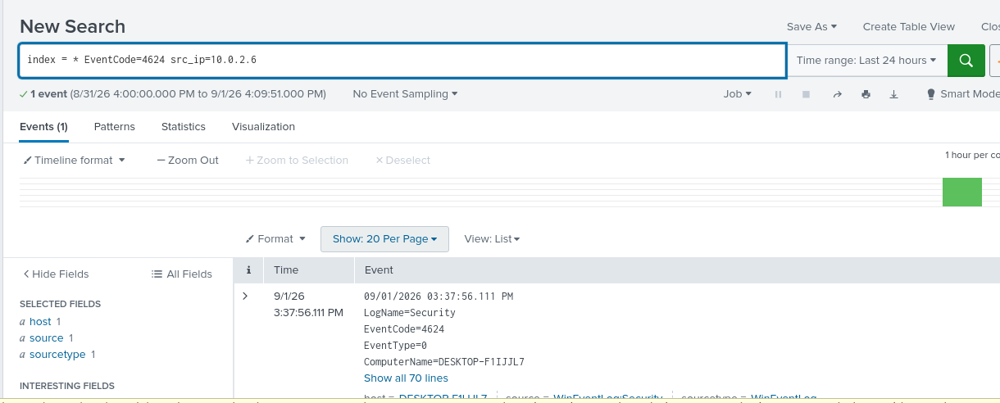

# Case 01: Brute Force Attack Detection (RDP/SMB)

## Summary
Simulated a brute-force credential attack against a Windows 10 VM using Hydra, then detected and analyzed the attack using 
native Windows Event Logs and Splunk. RDP was attempted first but proved unreliable with Hydra's experimental RDP module; 
SMB was used as the final, successful attack vector.

---

## Environment

| Component | Details |
|---|---|
| Target | Windows 10 VM |
| Target IP | 10.0.2.15 |
| Attacker / SIEM | Lubuntu VM |
| Attacker IP | 10.0.2.6 |
| Network | VirtualBox NAT Network ("SOC") |
| Tools | Hydra v9.2, Sysmon, Splunk |

---

## Attack Simulation

**Tool used:** Hydra v9.2

**Initial attempt (RDP) — unsuccessful:**
hydra -L users.txt -P passwords.txt rdp://10.0.2.15
(./Screenshots/04a- rdp.png)

> Result: Connection failed to establish. Hydra's RDP module is experimental 
and known to be unreliable with modern Windows RDP security negotiation.

**Final attempt (SMB) — successful:**
hydra -L users.txt -P passwords.txt smb://10.0.2.15
(./Screenshots/05-hydra attack smb.png)

| Field | Value |
|---|---|
| Target Service | SMB (TCP/445) |
| Login Attempts | 14 |
| Valid Credentials Found | win10 / test123 |
| Attack Duration | ~1 second |
| Date/Time | Sep 1, 2026, 15:37:54 |

---

## Detection — Windows Event Logs

- **Event ID 4625** (Failed Logon) — multiple entries observed, matching the timestamp of the Hydra run, source IP 10.0.2.6
- **Event ID 4624** (Successful Logon) — one entry immediately following the failed attempts, same source IP

---

## Detection — Splunk

**Search: Failed logon events**
index=* EventCode=4625

**Search: Successful logon events**
index=* EventCode=4624

---

## Timeline

| Time | Event |
|---|---|
| 15:37:54 | Hydra SMB attack initiated |
| 15:37:54 - 15:37:55 | 13 failed logon attempts (Event 4625) |
| 15:37:55 | Successful logon with valid credentials (Event 4624) |
| 15:37:55 | Hydra reports 1 valid password found |

---

## Indicators of Compromise (IOCs)

| Indicator Type | Value |
|---|---|
| Source IP | 10.0.2.6 |
| Compromised Username | win10 |
| Compromised Password | test123 |
| Protocol | SMB (TCP/445) |
| Pattern | Rapid repeated auth failures followed by a single success |

---

## Key Finding

> SMB proved to be a far more reliable brute-force vector than RDP in this environment. 
The attack was fully visible in both native Windows Security logs and Splunk, with a clear "many fails → one success" 
pattern that maps directly to real-world credential-stuffing/brute-force behavior.

---

## What I Learned
- How to simulate a realistic brute-force attack in an isolated home lab
- The difference between Hydra's RDP and SMB modules in terms of reliability
- How Windows logs failed (4625) vs successful (4624) authentication events
- How to pivot from raw Windows logs into structured Splunk searches
- The value of documenting failed approaches (RDP) alongside successful ones

---

## Tools & Technologies
Hydra, Sysmon, Splunk, VirtualBox (NAT Network)