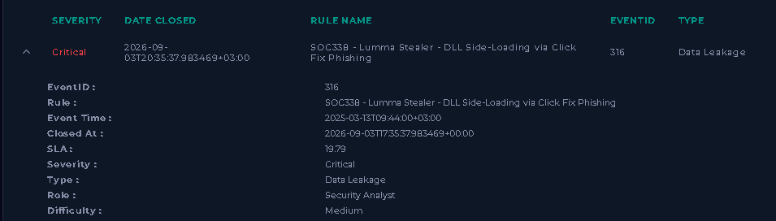
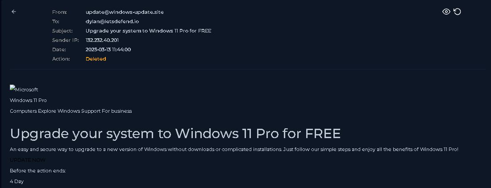
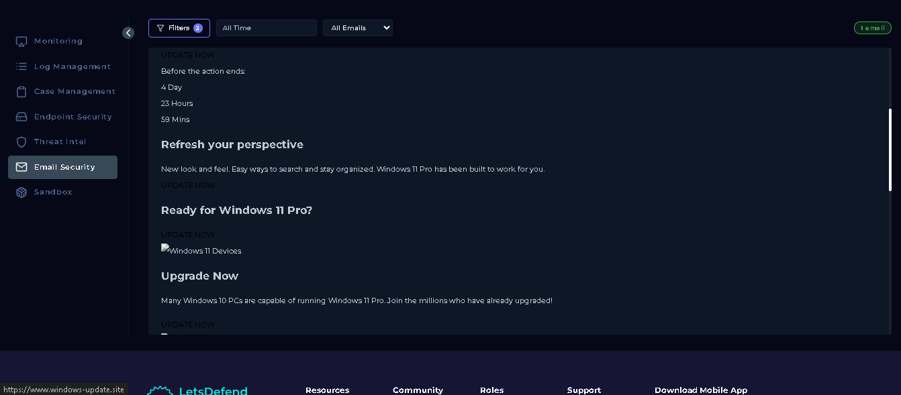
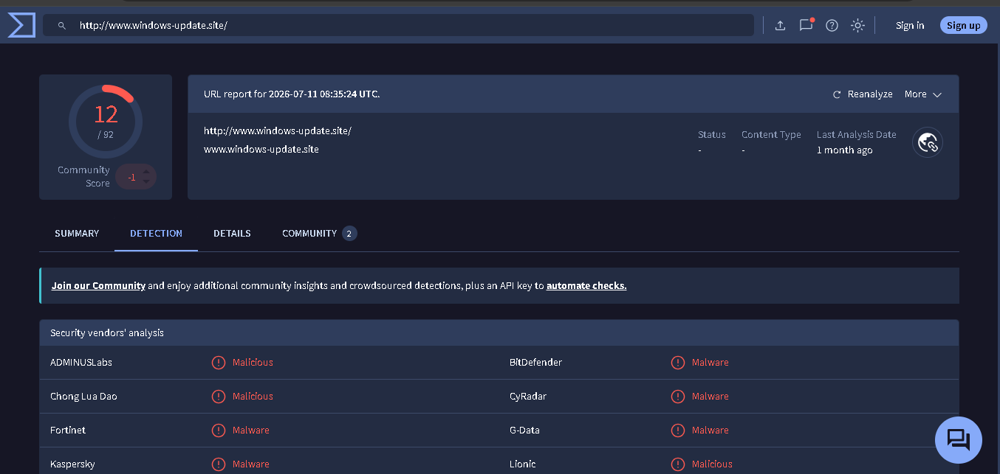
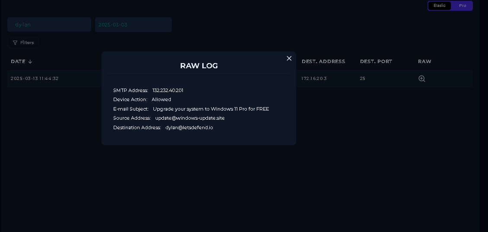
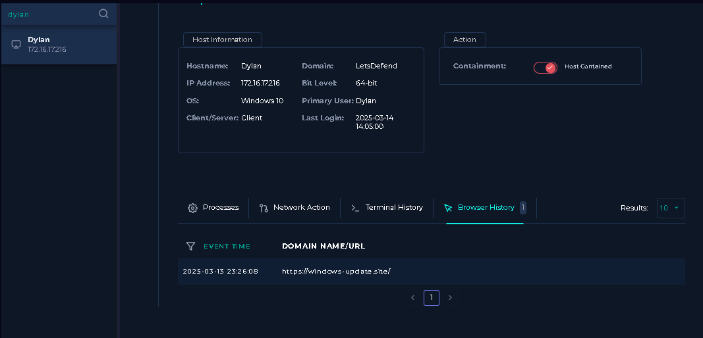
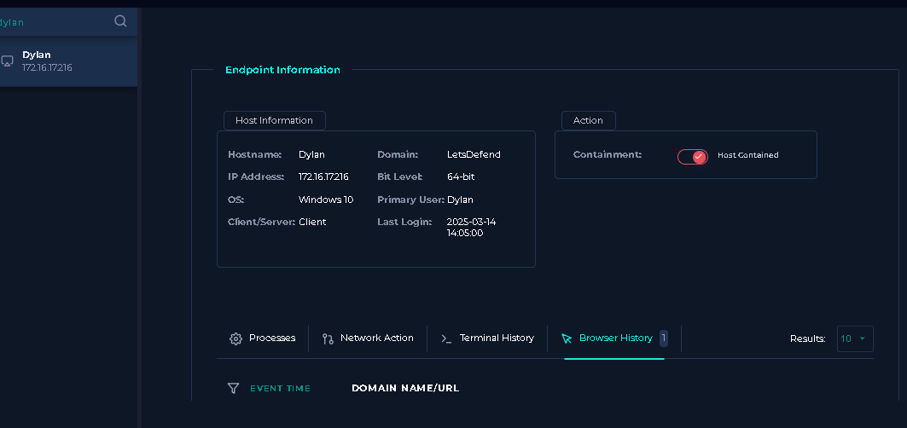
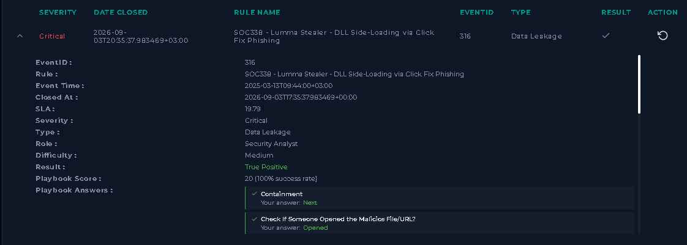
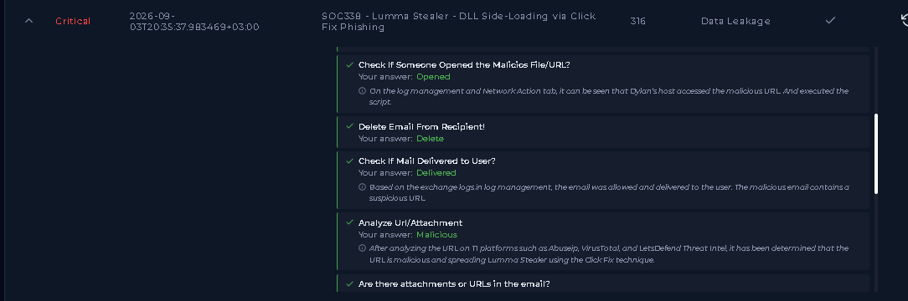
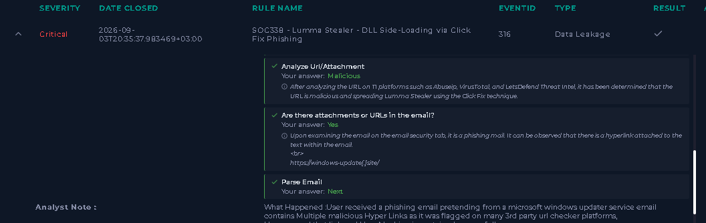

# SOC338 - Lumma Stealer: DLL Side-Loading via ClickFix Phishing

**Platform:** LetsDefend
**Event ID:** 316
**Date of Alert:** 2025-03-13
**Severity:** Critical
**Type:** Data Leakage
**Result:** True Positive
**Playbook Score:** 20/20 (100%)
**Difficulty:** Medium

---

## Summary

A user (Dylan) received a phishing email impersonating a Microsoft Windows Update
notification, offering a "free upgrade to Windows 11 Pro." The email contained a
malicious link. Dylan clicked the link, which led to a page using the **ClickFix**
technique — a social engineering method that tricks the user into manually running
a malicious script, resulting in **DLL side-loading** and deployment of the
**Lumma Stealer** infostealer malware on his host.



---

## Investigation

### 1. Email Analysis

The email was reviewed in the Email Security module.

- **From:** update@windows-update.site
- **To:** dylan@letsdefend.io
- **Subject:** Upgrade your system to Windows 11 Pro for FREE
- **Sender IP:** 132.232.40.201
- **Date:** 2025-03-13 11:44:00

The email impersonated an official Microsoft Windows Update service and pressured
the user with urgency ("Before the action ends: 4 Days").



The email body contained an embedded malicious hyperlink:

```
hxxps://windows-update[.]site/
```



### 2. URL / Threat Intel Analysis

The URL was checked against VirusTotal and other threat intel sources (AbuseIPDB,
LetsDefend Threat Intel). Multiple security vendors flagged the domain as
**malicious/malware**, including ADMINUSLabs, BitDefender, Fortinet, G-Data,
Kaspersky, and CyRadar.



### 3. Log Management

Raw SMTP logs confirmed the email was **allowed** through the mail gateway and
delivered to the recipient — it was not blocked at the perimeter.

- **SMTP Address:** 132.232.40.201
- **Device Action:** Allowed
- **Source:** update@windows-update.site
- **Destination:** dylan@letsdefend.io



### 4. Endpoint Analysis

Reviewing Dylan's endpoint (hostname: `Dylan`, IP: `172.16.17.216`, Windows 10)
confirmed the malicious URL appeared in the browser history, showing the user
did click the link and load the page.

- **Event Time:** 2025-03-13 23:26:08
- **URL Visited:** hxxps://windows-update[.]site/



### 5. Containment

The affected host was isolated to prevent further compromise or lateral movement,
and the malicious email was deleted from the recipient's mailbox.



---

## Playbook Results

All investigative playbook steps were completed with a 100% success rate:

| Step | Answer |
|---|---|
| Check if someone opened the malicious file/URL | Opened |
| Delete email from recipient | Delete |
| Check if mail delivered to user | Delivered |
| Analyze URL/Attachment | Malicious |
| Are there attachments or URLs in the email? | Yes |
| Containment | Contained |





---

## Indicators of Compromise (IOCs)

| Type | Value |
|---|---|
| Sender Email | update@windows-update.site |
| Sender IP | 132.232.40.201 |
| Malicious URL | hxxps://windows-update[.]site/ |
| Affected Host | Dylan (172.16.17.216) |

---

## Verdict

**True Positive — Critical severity.** Confirmed phishing email led to user
execution of a malicious script via the ClickFix technique, resulting in DLL
side-loading and deployment of the Lumma Stealer infostealer. Classified as
Data Leakage due to the credential/data-theft capability of the payload.

## Recommended Actions

- Host isolation/containment (completed)
- Delete phishing email from mailbox (completed)
- Block sender domain (`windows-update.site`) and IP (`132.232.40.201`) at the
  mail gateway and firewall
- Force credential reset for the affected user as a precaution against
  stealer-based credential theft
- User awareness reminder on ClickFix-style phishing (fake update/verification
  pages instructing manual script execution)
